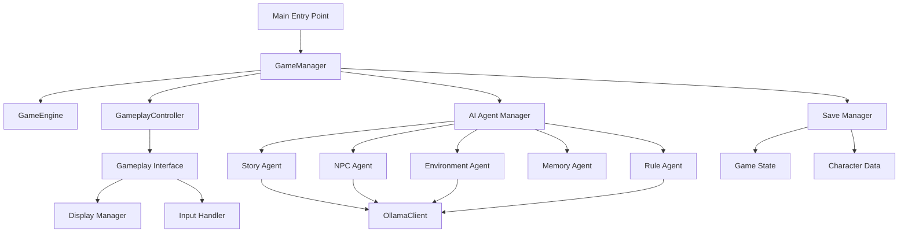

# Program Development Document (PDD)
# Cthulhu Solo TRPG System

## 1. Executive Summary

### 1.1 Project Overview
Cthulhu Solo TRPG is an AI-powered single-player tabletop role-playing game system inspired by H.P. Lovecraft's cosmic horror mythos. The system leverages advanced AI agents through Ollama to create dynamic, responsive narrative experiences without requiring a human game master.

### 1.2 Development Philosophy
- **Agent-Based Architecture**: Specialized AI agents handle different game aspects
- **Free-Text Input System**: Natural language processing for player actions
- **Modular Design**: Loosely coupled components for maintainability
- **Fallback Resilience**: Graceful degradation when AI services unavailable

### 1.3 Technology Stack
- **Language**: Python 3.8+
- **AI Framework**: Ollama (gpt-oss-120b model)
- **UI Libraries**: Rich (terminal), tkinter (desktop)
- **Storage**: JSON-based persistence
- **Testing**: pytest, asyncio

## 2. System Architecture

### 2.1 High-Level Architecture
```
┌─────────────────────────────────────────────────────────┐
│                    User Interface Layer                  │
│  (CLI Interface / Desktop Interface / Gameplay Interface)│
└─────────────────────────────────────────────────────────┘
                            │
┌─────────────────────────────────────────────────────────┐
│                  Core Game Systems Layer                 │
│    (GameManager / GameEngine / GameplayController)       │
└─────────────────────────────────────────────────────────┘
                            │
┌─────────────────────────────────────────────────────────┐
│                    AI Agent Layer                        │
│  (StoryAgent / NPCAgent / EnvironmentAgent / RuleAgent)  │
└─────────────────────────────────────────────────────────┘
                            │
┌─────────────────────────────────────────────────────────┐
│                  AI Infrastructure Layer                 │
│     (OllamaClient / UltraThink / ThinkCoordinator)      │
└─────────────────────────────────────────────────────────┘
                            │
┌─────────────────────────────────────────────────────────┐
│                    Data Persistence Layer                │
│       (SaveManager / ContentManager / MemoryStore)       │
└─────────────────────────────────────────────────────────┘
```

### 2.2 Component Relationships


## 3. Core Components

### 3.1 Game Manager (`src/core/game_manager.py`)
**Purpose**: Central orchestrator for all game systems

**Key Responsibilities**:
- System initialization and teardown
- Agent lifecycle management
- State coordination between components
- Error recovery and fallback handling

**Key Methods**:
```python
async def initialize() -> None
async def start_new_game(character_data: Dict) -> None
async def load_game(save_file: str) -> None
async def save_game(slot: str) -> None
async def shutdown() -> None
```

### 3.2 Gameplay Controller (`src/core/gameplay_controller.py`)
**Purpose**: Manages game flow and player interactions

**Key Features**:
- Turn-based gameplay loop
- Free-text action processing
- Story content generation
- Investigation opportunities tracking

**Data Structures**:
```python
@dataclass
class StoryContent:
    text: str
    content_id: str
    scene_id: str
    tension_level: TensionLevel
    metadata: Dict[str, Any]
    investigation_opportunities: List[str]
    story_threads: List[str]

@dataclass
class NarrativeContext:
    scene_id: str
    turn_number: int
    story_threads: Dict[str, Any]
    choice_history: List[str]
    narrative_flags: Dict[str, Any]
    character_state: Dict[str, Any]
    tension_level: TensionLevel
```

### 3.3 AI Agent System

#### 3.3.1 Base Agent (`src/agents/base_agent.py`)
**Purpose**: Common functionality for all AI agents

**Key Features**:
- Memory management with importance scoring
- Response generation with retry logic
- Context building and pruning
- Performance metrics tracking

**Memory System**:
```python
@dataclass
class AgentMemory:
    content: str
    timestamp: float
    importance: int
    metadata: Dict[str, Any]
    memory_type: str
```

#### 3.3.2 Story Agent (`src/agents/story_agent.py`)
**Purpose**: Narrative generation and story progression

**Capabilities**:
- Scene generation based on context
- Player action interpretation
- Investigation opportunities generation
- Tension management
- Story thread tracking

**Key Methods**:
```python
async def process_player_action(context: Dict) -> Dict
async def generate_scene(context: Dict) -> Dict
def _generate_investigation_opportunities(context: Dict) -> List[str]
```

#### 3.3.3 NPC Agent (`src/agents/npc_agent.py`)
**Purpose**: Non-player character behavior and dialogue

**Features**:
- Dynamic NPC generation
- Contextual dialogue generation
- Personality and motivation tracking
- Relationship management

#### 3.3.4 Environment Agent (`src/agents/environment_agent.py`)
**Purpose**: Location descriptions and atmosphere

**Responsibilities**:
- Environmental detail generation
- Atmosphere and mood setting
- Object and clue placement
- Weather and time effects

### 3.4 Ultra-Think System

#### 3.4.1 UltraThink (`src/ai/ultra_think.py`)
**Purpose**: Multi-layered reasoning for complex scenarios

**Process Flow**:
1. Initial Analysis
2. Deep Pattern Recognition
3. Creative Exploration
4. Critical Evaluation
5. Synthesis and Integration
6. Meta-Reflection

#### 3.4.2 UltraThink Coordinator (`src/ai/ultra_think_coordinator.py`)
**Purpose**: Orchestrates multiple agents for complex analysis

**Coordination Strategy**:
- Parallel agent consultation
- Response synthesis
- Conflict resolution
- Quality assurance

### 3.5 User Interface System

#### 3.5.1 Gameplay Interface (`src/ui/gameplay_interface.py`)
**Purpose**: Core gameplay interaction handling

**Key Features**:
- Free-text input processing
- Rich terminal display
- Real-time status updates
- Investigation opportunities display

**UI Layout**:
```
┌─────────────────────────┬──────────────────┐
│     Story Content       │   Side Panel     │
│                         │ - Character Info │
│  [Narrative Text]       │ - Investigations │
│                         │ - Story Threads  │
│                         │ - Game Status    │
├─────────────────────────┴──────────────────┤
│           Player Input Area                 │
│  > [Free-text action input]                │
└─────────────────────────────────────────────┘
```

## 4. Data Flow

### 4.1 Player Action Processing
```
1. Player Input (free-text)
   ↓
2. GameplayInterface.handle_input()
   ↓
3. GameplayController.process_player_action()
   ↓
4. StoryAgent.process_player_action()
   ↓
5. Action Type Analysis
   ↓
6. Context Building
   ↓
7. Response Generation
   ↓
8. StoryContent Creation
   ↓
9. UI Update
```

### 4.2 AI Response Generation
```
1. Agent receives context
   ↓
2. Memory retrieval (relevant memories)
   ↓
3. UltraThink processing (if complex)
   ↓
4. Ollama API call
   ↓
5. Response parsing
   ↓
6. Memory storage
   ↓
7. Return structured response
```

## 5. Key Algorithms

### 5.1 Memory Relevance Scoring
```python
def calculate_relevance(memory: AgentMemory, context: Dict) -> float:
    keyword_score = sum(1 for kw in context_keywords if kw in memory.content)
    recency_score = 1.0 / (1.0 + (current_time - memory.timestamp) / 3600)
    importance_score = memory.importance / 10.0
    total_score = (keyword_score * 0.4 + 
                   recency_score * 0.3 + 
                   importance_score * 0.3)
    return total_score
```

### 5.2 Action Type Classification
```python
def _analyze_action_type(action_text: str) -> str:
    investigation_keywords = ['조사', '살펴', '확인', '찾']
    movement_keywords = ['이동', '가다', '들어가다', '나가다']
    interaction_keywords = ['대화', '말하다', '묻다']
    
    # Pattern matching logic
    for keyword in investigation_keywords:
        if keyword in action_text:
            return 'investigate'
    # ... additional classification
```

### 5.3 Investigation Opportunity Generation
```python
def _generate_investigation_opportunities(context: Dict) -> List[str]:
    base_opportunities = location_specific_opportunities[scene_id]
    tension_modifiers = tension_based_opportunities[tension_level]
    story_relevant = filter_by_story_threads(opportunities)
    return prioritize_opportunities(combined_list)[:5]
```

## 6. Error Handling Strategy

### 6.1 Fallback System Hierarchy
1. **Primary**: AI Agent with Ollama
2. **Secondary**: Cached responses
3. **Tertiary**: Rule-based generation
4. **Emergency**: Static content

### 6.2 Error Recovery Patterns
```python
try:
    response = await agent.process_input(context)
except OllamaConnectionError:
    response = self._get_cached_response(context)
except Exception as e:
    logger.error(f"Agent error: {e}")
    response = self._get_fallback_response(context)
```

## 7. Performance Optimizations

### 7.1 Caching Strategy
- **Response Cache**: LRU cache for repeated queries
- **Memory Index**: Sorted memory lists for quick retrieval
- **Context Pruning**: Limit context size to essential information

### 7.2 Async Operations
- All AI calls are async/await
- Parallel agent consultations when possible
- Non-blocking UI updates

### 7.3 Resource Management
- Memory cleanup when exceeding limits
- Connection pooling for Ollama
- Lazy loading of content data

## 8. Security Considerations

### 8.1 Input Sanitization
- Free-text input validation
- Command injection prevention
- Path traversal protection in save files

### 8.2 Data Protection
- No sensitive data in logs
- Secure save file handling
- API key management (if applicable)

## 9. Extensibility Points

### 9.1 Adding New Agents
1. Inherit from `BaseAgent`
2. Implement `process_input()` method
3. Register in `GameManager.agents`
4. Add specific prompts and behaviors

### 9.2 Custom UI Implementations
1. Implement `BaseInterface`
2. Handle display and input methods
3. Register in UI factory

### 9.3 Content Extensions
- Add new locations in content data
- Define new investigation types
- Create custom story threads

## 10. Development Workflow

### 10.1 Code Organization
```
src/
├── agents/          # AI agent implementations
├── ai/              # AI infrastructure
├── core/            # Core game systems
├── data/            # Data management
├── ui/              # User interfaces
└── utils/           # Utilities and helpers
```

### 10.2 Testing Strategy
- Unit tests for individual components
- Integration tests for system interactions
- End-to-end tests for gameplay scenarios
- Performance tests for AI response times

### 10.3 Version Control
- Feature branches for new development
- Main branch for stable releases
- Semantic versioning (MAJOR.MINOR.PATCH)

## 11. Future Enhancements

### 11.1 Planned Features
- Multiplayer support
- Voice input/output
- Advanced visualization
- Mobile client
- Cloud save synchronization

### 11.2 Technical Improvements
- Model fine-tuning for Lovecraftian style
- Improved memory compression
- Real-time collaboration
- Plugin system for mods

## 12. Maintenance Guidelines

### 12.1 Code Standards
- PEP 8 compliance for Python code
- Type hints for all public methods
- Comprehensive docstrings
- Meaningful variable names

### 12.2 Documentation Requirements
- Updated CLAUDE.md for AI assistance
- API documentation for public interfaces
- User guides for gameplay
- Developer guides for extensions

### 12.3 Monitoring and Logging
- Structured logging with levels
- Performance metrics collection
- Error tracking and reporting
- Usage analytics (opt-in)

---

*Last Updated: 2025-01-21*
*Version: 1.0.0*
*Document Status: Active*